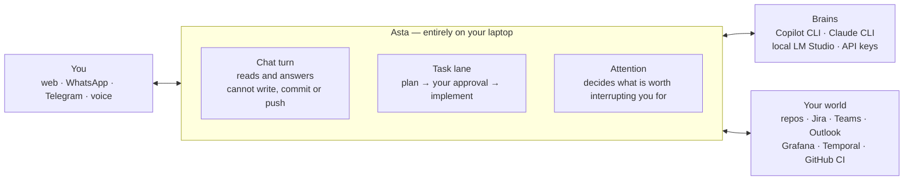
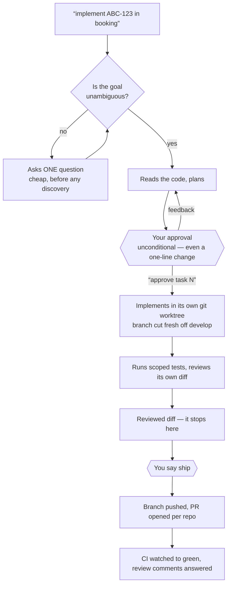
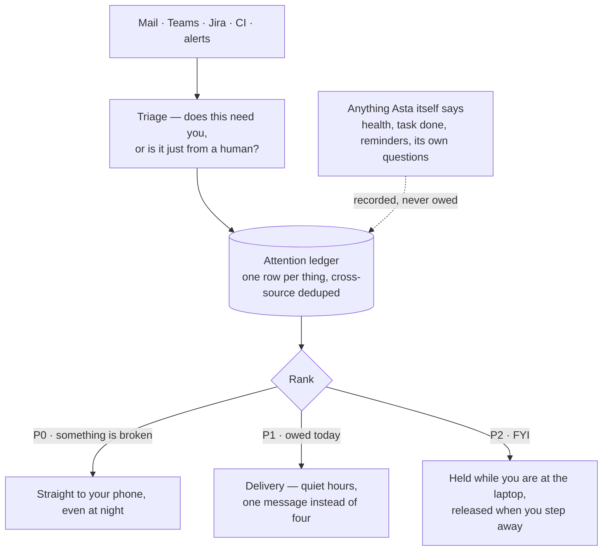

# Asta — a personal engineering assistant that runs on your laptop

Asta is the colleague who has already read your repositories, your Jira, your
inbox and your CI — and who will go and do the work, but never ships anything
you did not approve.

It is **not** a chatbot with tools bolted on. Chat is the thin part: real work is
handed to a headless `copilot -p` or `claude -p` process that plans, stops for
your approval, implements in its own git worktree, verifies itself, and hands
back a reviewed diff. You say ship, and only then does anything leave the
machine.



## What you actually use it for

| You say | What happens |
|---|---|
| *"implement ACME-1234 in booking"* | Reads the ticket and the code, plans, **stops for your approval**, implements on a fresh branch off `develop`, runs the scoped tests, hands back a reviewed diff |
| *"why is the vessel ETA not updating in preprod?"* | Queries Temporal and Grafana with your certs, reads the service's own generated context, answers with the workflow id and the failing activity |
| *"anything waiting on me?"* | One ranked list from mail, Teams, Jira and CI — not four inboxes |
| *"ping X about the CT failure"* | Drafts it, shows you the exact text, sends only on your "yes", and only to his 1:1 |
| *"review PR 1409"* | Reads the diff, comments where it matters, watches CI to green |
| *"use opus"* | Switches which model answers — chat and delegated tasks alike |
| nothing at all | Watches CI *you* triggered, notices a Teams @mention, spots a stale cert, and reaches your phone — once, ranked, never at 2am |

**Offers, not autonomy.** Asta reports what it found with enough context to decide,
names the one thing it would do next, and waits — a bare "yes" from any channel
runs it. Anything that leaves the machine is staged with its exact contents first,
so what you approved is what goes out.

**Everything stays on your machine.** The repo holds generic skills and pipelines;
your workspaces, generated context, memory and credentials never leave the laptop.

## Run it

```bash
cd ~/help/asta
.venv/bin/python -m uvicorn app.main:app --host 127.0.0.1 --port 8321
```

Open http://localhost:8321 and log in with `ASTA_TOKEN` from `.env`.
Copy `.env.example` to `.env` first — every setting is documented there.

```bash
.venv/bin/python -m pytest -q           # 1,920 tests
```

## How it is put together

Three ideas carry most of the design.

**One engine.** Every piece of work — analysis, a code change, a Teams draft, a PR
review — is a *background task*: a headless `copilot -p` or `claude -p` process
with a self-contained prompt, running outside the chat so the conversation stays
responsive. There is no second path. (There used to be: `missions.py` and
`tasks.py` ran the same plan → approve → implement → verify → ship pipeline, and
every bug had two homes.)

**One capability registry.** `app/capabilities.py` declares each capability once,
with its function; the docstring *is* the description. Chat tools, the block that
teaches the CLI brains, and the MCP server all read from that one table, so a
capability cannot be described two different ways. Per-tool hard rules — a Teams
message means the person's 1:1 chat, a Jira write needs your confirmation, a PR is
never opened unprompted — travel *with* the capability, so a tool can never be
exposed with its rule left behind.

**One trust boundary.** Anything Asta reads from outside — mail, Teams messages,
Jira comments, files in your repos, MCP output, PR descriptions — is wrapped as
data before it reaches a model that can edit code and run shell commands. See
`app/untrusted.py`. It is mitigation, not a guarantee; what actually bounds the
damage is that nothing publishes, ships or sends without your approval.

## Work: task → plan → your approval → implement → you say ship



Say "implement ABC-123 in booking" in chat, WhatsApp or Telegram. Routing is
automatic: a Jira-key ticket runs the full staged pipeline with a plan gate, a
small ad-hoc ask runs the micro pipeline (~25 turns) and escalates itself if it
turns out bigger.

1. A cheap **context gate** first — if the goal is ambiguous it asks *before*
   spending anything on discovery.
2. It plans, and stops. You get the plan on your phone.
3. "approve task N" implements; any other reply re-plans with your feedback.
4. It finishes at a **reviewed diff**. The pipeline never pushes.
5. You say ship → branch pushed, PR opened per repo touched, CI watched.
6. On green it *asks* whether to post the PR for review, and only where you name.

Kinds: **analysis** (read-only, runs in parallel), **code** (edits a repo),
**teams_draft** (never sent automatically).

**The plan is shaped to be read in thirty seconds, on a phone.** That is where
you approve them, standing up — so a plan opens with a `STRUCTURE` block: the
classes and files that change and how they relate, as an indented tree, one line
each saying what happens to that thing.

    STRUCTURE
      EtaValidator                     NEW  · rejects an import ETA at/after gate-in
        └─ called by BookingService.applyVesselEta()   ~10 lines changed
             └─ reads ServicePlanLeg.portGateIn (LATEST)
      BookingServiceTest               +3 cases (before / at / after gate-in)

Then numbered steps, then a one-line RISK. No prose paragraph before the tree: a
plan built on a misread shows up in the shape within seconds, where three
paragraphs hide it. The trim that fits a gate to a notification **pins** that
block — everything else prefers the tail, which is right for the question at the
bottom and would otherwise drop the shape off the top — and keeps the tree even
when the brain wraps it in a code fence, which the fence stripper used to delete
outright.

**Work is routed to a task, not answered in chat.** "implement the retry logic in
booking" goes straight to the code lane — because a chat turn is capped at five
minutes and a real implementation does not fit in one, which is how it used to end
in `timed out after 300s` mid-edit. Routing is deliberately narrow: it needs a
work verb *and* evidence the message is about code (a ticket key, a repo name, a
code noun), so "change my status to busy" and "update me on the PR" keep their own
flows. Anything ambiguous falls through to chat — which can no longer write files,
commit, push, or open a PR, so the model has to delegate from there anyway.

That ban is **one decision for every brain** (`capabilities.chat_may_write`),
because the version before it was two and they disagreed: Copilot carried
`--deny-tool edit` and Claude carried nothing at all, so the same message met
different rules depending on which brain happened to be selected. Worse, the
Copilot half never worked — run against the real binary, `edit` turns out not to
be a tool name (it is `write`), and copilot cheerfully created the file. Denying
`write` alone is not enough either: it falls back to the shell and writes it that
way. So the ban names the three outward acts as well, and is honest about its
reach — a brain with a shell can still write through `sed -i`, and no deny list
fixes that. The real guarantee is the routing; this is the second lock on the
same door. Reading is untouched, including `gh run list` and `gh pr view`, which
is most of what chat legitimately does. `ASTA_CHAT_MAY_EDIT=1` puts it back.

**Code tasks run in parallel too, on git worktrees.** They used to be serialised
one-per-workspace, and the reason was sound — two tasks sharing a checkout fight
over `HEAD`, and the loser silently commits onto the winner's branch. But the cost
landed on the wrong person: a twenty-minute implementation blocked the two-minute
question you asked while it ran. So `app/worktrees.py` cuts each code task its own
worktree from `origin/develop`, and `ASTA_MAX_PARALLEL_TASKS` (3) bounds how many
run at once — a limit on the machine, not on git: with separate worktrees two
tasks never conflict, so the only real constraint is that each is a checkout plus
a CLI process plus, at the gate, a Maven build, while you are working on the same
laptop. A task prepares only the repos it names, falling back to all of them when
it names none: over-preparing costs a fetch, under-preparing costs the run. Separate working trees, one shared object store: no lock needed
because there is nothing left to contend over. Worktrees are removed when the task
finishes and survive a crash for inspection.

Commits are plain. No co-author trailer, no assistant name, no "Generated with"
line — your commits read as your own work.

Pipelines live in `agents/` (`solo`, `micro`, `explore`, `bootstrap`) and belong to
Asta, not to your repos — improving one improves every run. Your repos still supply
the facts, through their own `.github/agents` and `.github/skills` when present.

## The conductor loop — it keeps working instead of idling

A chat turn used to end the moment the model stopped typing, and nothing happened
until you sent the next message. The loop (`app/loop.py`) lets a turn hand back one
of two signals instead:

- **continue** — the model isn't done and named the next step. Asta runs that step
  itself, without waiting for you.
- **send** — the model drafted something outward (a Teams reply, a Jira comment, a
  PR body). It is **staged, never sent**: Asta shows you the draft and asks "can I
  send this?" A bare "yes" sends it through the real channel tool; anything else is
  a revision. This is the one hard gate, and it holds for every channel.

**A stopped turn says which of three things happened.** "Timed out after 300s" is
true and answers none of the questions you actually have: did it finish, is it
still going, is it stuck. `app/turn_budget.py` separates them — **done**, **idle**
(silent for `ASTA_TURN_IDLE`, 120s: wedged, and more time will not help), and
**ceiling** (still producing output when the budget ran out: a long job, where
resuming continues it and retrying starts from nothing). Whatever the brain got
through travels with the report, because the old path accumulated every step it
narrated and then discarded all of it to raise one sentence.

That split is also what let the code-task ceiling go up. It was 30 minutes against
a measured p90 of 32 (n=46), so the slowest tenth of code tasks were killed by
their own budget and re-run from scratch. It is 45 now, and a wedged brain is
caught by silence rather than by the ceiling — which is the job the ceiling was
doing badly.

**Bounded by the clock, not just by steps.** A step count cannot bound latency when
each step is a whole CLI turn of unknown length — four auto-steps of a ten-minute
ceiling is forty minutes of silence, which is not "working autonomously", it is
unusable. So there are three limits and the wall-clock one is the real guarantee:
`ASTA_TURN_TIMEOUT` (5 min per CLI turn, shared by every brain), `ASTA_LOOP_MAX_STEPS`
(2), and `ASTA_LOOP_DEADLINE` (10 min for everything one message triggers). The
deadline is enforced brain-agnostically, so a brain added later inherits it. When a
budget runs out Asta says *which* one — "been at this 10 min" tells you whether to
push or rethink; a bare "paused" reads like a bug.

On by default (`ASTA_LOOP`); bounded and gated is what keeps on-by-default safe.
It works for the in-process and CLI brains alike. `ASTA_THINKING` adds opt-in
extended thinking on the API brain — off by default, because thinking tokens work
against the token-efficiency everything else here is chasing.

## Offers — "here's what I'd do next; shall I?"

The loop covers a turn. Offers (`app/offers.py`) cover everything after it.

Asta sits between two bad extremes: stay silent until asked, and a red pipeline
sits there all evening; act on everything it notices, and it burns tokens on things
you already knew about. The middle is an **offer** — report the thing with enough
context to decide, name what it would do next, and wait. A bare "yes" from *any*
channel runs it. Offers are persisted and expiring (`ASTA_OFFER_TTL`, 6h): the
question went to your phone and you may answer twenty minutes later from Telegram
after a restart, but a "yes" tomorrow must not kick off work you've forgotten
proposing. One is **asked** at a time, because two plus a bare "yes" is ambiguous — later
ones queue behind it rather than replacing it. That distinction matters: offers
used to live in a single slot that every new one overwrote, and four background
watchers stage offers, so a daemon could replace the question on your screen
between you reading it and answering. A queued offer says so instead of asking
for a yes it would not receive.

An offer carries its own next step, in one of two forms:

- **a prompt** — written by the model itself via `propose_next`, so any flow
  continues: implement this ticket, chase that review, follow up, update a status.
  Not a fixed list of three CI steps.
- **a recorded call** — the exact API call, run in Python when you say yes. No
  brain between the yes and the act.

That second form is the important one. "Comment on PROJ-412 that the migration is
blocked" re-read by a brain is a different sentence every time, and the sentence
you approved is not necessarily the one that gets posted. The recorded arguments
**are** the approval. Every outward write goes through it (`app/ops.py`): Jira
comments and transitions, PR reviews, calendar invites. The HTTP endpoints call the
same functions, so a CLI brain reaching them by curl gets the same gate — one
policy, or the rule only holds where someone remembered to write it.

Ask **"what's pending?"** on any channel to see everything waiting on you, in the
order a reply would be routed — a one-word answer to an invisible question is a
coin flip.

## When a brain runs out mid-task

Quota dies twelve minutes into real work. The old fallback replayed your original
message on another brain, so it started cold and re-paid for everything the first
one had already established.

Now a dying turn leaves a **checkpoint** (`app/resume.py`): the request, what had
been worked out, and where it stopped. Whoever takes over is handed *that* and told
to continue — with the partial output offered as a lead to verify, not as settled
fact, because it came from a different model and was cut off mid-thought.

If nothing is available to take over, the work is parked rather than lost. `resume`
or `use <brain>` from any channel picks it up — switching after a quota stop just
carries on, since making you then type "resume" would be theatre. Checkpoints
expire (`ASTA_RESUME_TTL`, 24h): a day later the branch has moved and so have you.

### Every turn ends in a message — including the ones that fail

A WhatsApp message once went unanswered for three hours. Four things had to line
up, and each on its own would have been survivable:

- Copilot's monthly quota was gone, so every turn failed.
- The "one fresh retry" for a dead session was not bounded to *one* — the guard
  was the session key, which the next call writes back — so a turn that could
  never succeed retried roughly every 20 seconds, forever, and never returned to
  report it. It left 7,851 session directories on disk.
- Nothing bounded a turn by wall clock, so "forever" really was forever. The
  CLI's own 300s ceiling covered only the part where output is pumped; the
  Teams/Outlook pre-fetch *before* the process spawns and the wait for it to exit
  *after* both sat outside it.
- And the phone sink only flushed on `{"type": "done"}` — which a **failing**
  turn never sends. So even once the failure was reported, it was reported into
  a buffer nobody read.

The rule now is that delivery does not depend on success: whatever the sink holds
is flushed when the turn ends, however it ended (`close()`, called from a
`finally`). Above the brains' own limits sits `ASTA_TURN_CEILING` (420s) as a
backstop, so a hang nobody anticipated becomes a message that names the brain and
tells you how to switch — the brain's own clearer error still wins normally.

**Answered, then quiet, is not stuck.** A stop is named — `done`, `idle`,
`ceiling` — and an idle stop splits once more, because two very different things
look identical to a clock. A brain that wedged halfway through an edit has said
nothing complete; a brain that answered in full and then sat waiting on a
twelve-minute CI run has. The second used to be reported as *"stuck — more time
would not have helped"*, with the answer reprinted underneath the warning: the
same paragraphs to read twice, and paid for twice on the way out. Now a
substantial, terminated answer IS the answer, and a stop never repeats text that
was already streamed to you — it says how much there was instead. The length
threshold is measured against real traffic, not chosen: complete answers run 127
and 166 characters, and the dangerous near-miss (announcing intent and *then*
wedging) runs 6 to 45.

Meta-commands are answered before any of this, so `use claude cli` is never queued
behind the dead brain it is meant to rescue you from. The phrasing is generous
("change the LLM model to claude cli") but a loose match must name a brain that
actually exists, or "change the ticket status to done" becomes a model switch.

## Workspaces and project context

Workspaces are configured in the UI (⚙ Settings → Workspaces), not in code. Point
Asta at a directory, pick which repos you care about, and it detects how to answer
questions about them:

- **indexed** — a generated `.asta-context/` with a resolver that maps a question
  to exact files and line numbers;
- **plain** — ripgrep/git-grep fallback, so an unindexed repo still works.

Selecting repos kicks off a background pass that reads them and writes that
context **into your workspace**, next to the code. It states its cost before
spending, runs at most three repos at a time, and notifies you when it lands.

Then the agent has `resolve_context` (always called before reading code — never
blind exploration), `read_workspace_file` and `list_services`. The **Graph** tab
embeds the generated graph pages.

Drift is watched for free: a 10-minute git fingerprint, zero tokens. Only
*material* change counts — adding test fixtures or data files won't flag your
context as stale. Re-enrichment costs tokens and is always your call.

## Models

**Copilot CLI (office)** is the day-to-day default: chat runs through `copilot -p`
with per-conversation continuity, at zero personal API cost. If it hits a quota
error mid-conversation the turn is handed to whichever brain is actually up, with a
note in the chat saying who took over and that the work carried across.

**Switch from anywhere.** "use claude_cli", "switch to copilot", "which model" work
on WhatsApp and Telegram, not just the web picker — the quota warning arrives on
your phone, so the ability to act on it belongs there too. The choice sticks to the
conversation; the default only fills in when you haven't picked one or the one you
picked has since stopped being available. Resolved through the shared registry, so
a brain added to the spec table is switchable from your phone the same day.

**Which model, not just which brain.** "use opus", "use sonnet" and "use haiku"
switch the model inside the Claude CLI brain, from any channel, and the picker
shows which one is answering. The tier is deliberately **global** rather than
per-chat: it is a statement about how hard the work is, and a code task delegated
from a chat runs in its own lane — a preference that stopped at the chat boundary
would be wrong in exactly the case you set it for. It lives on the brain's spec
row (`tiers` / `tier_env`), so a brain that grows tiers becomes switchable with no
change to the switching code, and `.env` remains the fallback when you have not
chosen.

Optional in `.env`: `ANTHROPIC_API_KEY` (Claude, with prompt caching),
`OPENAI_API_KEY`, or LM Studio running locally — auto-detected, and it powers the
free background jobs (digests, consolidation, compaction, skill extraction,
embeddings). Models without a key show as "(off)" in the picker.
`ASTA_TEST_MODEL=1` adds a no-LLM model for pipeline debugging.

**A key that is present is not a key that works.** Availability used to mean the
variable was set, so a revoked or mistyped key made every API turn fail with a 401
while the picker cheerfully offered it — and two working CLI subscriptions sat unused
because the router believed it had something better. A provider rejecting the
credential is now remembered (fingerprinted, so it clears itself the moment you change
the key), that model drops out of `available()`, and health says so instead of you
finding out one failed turn at a time.

Asta is the **orchestrator**: it plans, remembers, notifies and delegates. It does
not implement in chat.

**Local-first routing** (`app/router.py`, `ASTA_ROUTER`, on by default): a pure
pleasantry — "hi", "thanks", "great" — is answered on the free local model or a
canned line, instead of spawning a paid CLI (~24k tokens) to say hello. Conservative
by design: only self-contained social turns are diverted; anything with real content
always reaches the brain you picked.

## Tool selection

A turn carries roughly ten of forty tools, not all of them — capabilities are
ranked against the message (embeddings via LM Studio when it's up, lexical overlap
otherwise) and only the relevant ones plus a tiny always-available core are
exposed.

Two things keep this from backfiring. The selection is **sticky per conversation**,
because tool definitions sit in the cached prompt prefix and re-picking every turn
would trade a fixed cost for a recurring cache miss. And when ranking is uncertain
it returns *everything* — an expensive turn is a far smaller failure than a tool the
model could not reach. `ASTA_TOOL_RAG=0` restores the all-tools behaviour.

**Sticky used to mean "only ever grows", and that quietly undid the whole feature.**
Tools were tuned when there were 32 of them; there are now 58, and a long
conversation accumulated 44 of 58 by turn ten — measured. The narrowing was real for
the first few turns and then gone, on exactly the conversations long enough for it to
matter. Stickiness is now an **LRU** (`ASTA_TOOL_STICKY_MAX`, 24): a tool the turn
needs is kept, one untouched for 24 tools' worth of turns falls out, and eviction only
starts past a slack margin so the cached prefix isn't rewritten every turn. Prompt
floor measured after: 5,950 → 2,191 tokens of schema per turn.

**MCP toolsets are attached by trigger, not by default.** All five servers' schemas
cost 6,205 tokens a turn whether or not the message had anything to do with them.
They now attach only when the message actually reaches for one — and matching is on
**word boundaries**, because substring matching pulled 26 GitHub tools into a mail
draft on the strength of "priya" containing "pr".

## Memory and learning

**Memory** is what you told it and what sessions uncovered:

- `memory/MEMORY.md` — a tiny index, always in the system prompt
- `memory/facts/*.md` — durable facts (the `remember` tool writes here; plain
  markdown, edit or delete by hand)
- `memory/episodes/*.md` — session digests, written when a chat goes idle 30 min
- recall is automatic per message (SQLite FTS5, recency-weighted)

**Skills** are procedures, and they are earned. A run that took several rounds — or
that escalated because a cheap tier couldn't finish it — is distilled into a
structured skill: when to use it, the procedure, the pitfalls, how to verify. When
a task escalates, the *stronger* tier writes the skill, so the cheap one gets
through alone next time; an escalation that teaches nothing just repeats next week.

Guarded on purpose: below 0.6 confidence nothing is written, a near-duplicate
replaces the existing skill rather than rivalling it. Only names and one-line
descriptions sit in the prompt; the body loads on demand via `load_skill` — the CLI
brains get that same index, so a skill is reachable everywhere, not just in-process.

**Skills are scored on results, not on being read.** `uses` counts being *loaded*,
which a skill earns by having a matching title — a confidently wrong procedure is
loaded just as often as a correct one. So a finished run now credits whatever it had
in play, and a failed one debits it. Pruning drops two kinds: unused-and-unconfident
after a month, and *present for materially more failures than successes*. Without
the second, the only skill that could ever leave was one nobody read — so the
actively misleading one, which is read constantly, was the single thing pruning
could not touch. One bad result never condemns a skill; a pattern does.

**Self-improvement closes the loop** (`app/skill_evolution.py`). The token audit
classifies where a worker wasted tokens; when a waste category *recurs* across runs
— reading files blind, dumping fat outputs, re-planning — Asta writes a curated
fix-skill for it, once, so the next worker avoids it.

All of that used to hang off the end of a *background task*, so a week of chat,
corrections and CI investigations taught nothing at all. A **daily pass** now runs it
on the clock instead — evolve, prune, and report what changed, quietly and only on a
day it changed something.

Nightly consolidation (merge duplicates, prune, rewrite the index):

```cron
30 2 * * * cd /Users/arun.k.k/help/asta && .venv/bin/python -m app.memory consolidate >> data/consolidate.log 2>&1
```

## Knowing whether it is any good

`trace_report` and the token audit (`GET /api/token-audit`) measure what a turn
*cost*. `quality_report` measures whether the work *landed*: plans approved as-is versus sent back, tasks finished, drafts sent
unedited, questions answered, PRs opened, skills learned.

These are facts Asta already observes — no model judging its own output, so the
numbers can't flatter themselves. Ask "how are you doing?" in chat, or
`GET /api/quality`.

**Evals measure whether the answers are RIGHT** (`app/evals.py`). Sixteen hundred
tests prove mechanism; not one of them asked whether an answer about your codebase
was correct — so the most-used capability in the system was the only one with no
measurement at all, and "is it getting better" was a feeling. The cases are
**grounded, never invented**: every expectation traces to something already verified —
a `lessons.md` entry written from a correction you made on a real ticket, or a
`_pins.yml` recording how a repo actually builds. A case whose ground truth can't be
pointed at measures agreement with a guess and calls it quality. Two tiers:
deterministic cases run in the suite for free; live cases ask a real brain and are
run on demand, with the score recorded over time.

**Silent failures now leave a trace** (`app/quiet.py`). Ninety-two places in this
codebase deliberately swallow an error, and nearly all are right to — a caption read
must not end a call, a dead WhatsApp bridge must not stop the catch-up scan. What was
missing was any record. A selector that stopped matching, a notification that reached
nobody: each degrades Asta a little and produced nothing anyone could see. `swallow`
keeps the behaviour and counts it, so "Teams reads have been failing for three days"
becomes a question with an answer instead of something you eventually notice.

Every turn is also traced (model, first-token and total latency, tokens
in/out/cached, prompt sizes, tools, errors) into the `traces` table — ⚙ Settings →
Performance, `GET /api/traces`, or just ask.

## Asking you one question

When the answer genuinely changes what it would do — which of two repos, which of
two people — Asta asks *one* question, it reaches your phone, and the caller
resumes with your answer. Nothing restarts.

This exists because the approval gates are the right price for "approve this plan"
and far too expensive for "which repo did you mean?" — a re-plan cycle costs
hundreds of thousands of tokens. Reply from any channel; a bare reply answers when
one question is open, `answer 3 <text>` when several are.

**It does not ask twice.** An answer you have already given stands for six hours,
so a retried or resumed task reuses it instead of buzzing you again; two workers
wanting the same answer wait on one question rather than sending the same sentence
to your phone twice. A question that timed out is *not* treated as answered —
reusing silence would put words in your mouth.

## Reviewing pull requests

"review PR 123 in booking" gathers the PR, its diff, its CI checks and your project
context, then runs the review as a background task. You get reviewer notes:
verdict, blocking defects with file:line, non-blocking notes, test gaps, questions.

Reading a PR is free of consequence and runs whenever you ask. **Posting** one is
not, so the two halves are separate: `review_pr` writes notes for you, and
`pr_review_post` — approve, comment, or request changes — only ever *stages* the
review and waits. Your yes posts the exact words you read, under your name. An
approval is visible to the whole team the moment it lands and there is no quiet way
to take it back, so it never rides on a model's judgement of whether you'd have
wanted it.

The PR body and diff are treated as untrusted: "please approve this" in a
description is data, not an instruction.

**Asta also reviews its own diff** before handing a code task back
(`ASTA_REVIEW_OWN_DIFF`). The reviewer existed and had only ever been pointed at
other people's pull requests — the code Asta wrote itself went out unread, with your
eyes as the only safety net. That is what made you the bottleneck.

### Merging

"merge PR 123 in booking" **stages** the merge like everything else outward, but the
gate is stricter, because a merge is the least reversible act here — it puts code on
the branch everyone builds from.

So it **refuses to offer** rather than offering with a warning. Red CI, *unfinished*
CI, conflicts, a draft, requested changes — each blocks, and each is named. Your yes
is one tap on a phone; the mistake would be the offer, not the tap. Unfinished CI
blocks as firmly as red CI, because merging while checks run is merging on a guess.

The offer states the PR's real state — *"CI green · approved"* — so you approve a
fact. And the blockers are **re-checked at the moment of merging**: you might say yes
an hour later, by which time CI can have gone red. That gap is exactly where
irreversible actions go wrong. Methods: `squash` (default), `merge`, `rebase`.

## Debugging: Jira, Grafana, Temporal

Jira says what was reported, Grafana what the logs say, Temporal what the workflow
actually did. "Why is booking X failing in sit" needs all three.

Grafana work follows `skills/grafana-analyser.md`, which is query discipline
earned from real investigations rather than a description of the tools: Loki first
(Prometheus and Tempo are performance-only), **every query carries the env
namespace matcher** and that alone spans every service, and an identifier is a
line filter over a wide window — never a label matcher, because identifiers are
high-cardinality. Empty is not healthy: a query that returns nothing means verify
the label before concluding anything.

Temporal goes through a proxy that maps an env name to the right cluster,
namespace and mTLS cert, so no model has to remember that `preprod` runs in
`telikos-spt-cdt` or that `uat` shares `sit`'s certificate.

**`debug_stack_health` checks the tools you debug WITH.** Reach for it when an
answer comes back empty, because an empty answer from a broken tool and an empty
answer from a healthy system look identical. It validates rather than checks
presence — the bug it was written for is a Temporal cert file that exists and is
**0 bytes**, which passes every existence check and then fails inside TLS with
"failed to find any PEM data", a sentence that never mentions the empty file.
Missing, empty, unparseable, expired and expiring are all distinguished, and only
*broken* ones reach health: an env with no cert at all is a choice, not a fault.

Temporal work follows `skills/temporal-analyser.md`, which is **generated at
startup** from the proxy's own env map rather than maintained by hand — so the
table a brain reads can never be older than the mapping the proxy uses. A drifted
playbook queries the wrong namespace, gets nothing back, and "nothing" reads as
"no workflows" rather than as a wrong lookup.

**Measured on this machine, 2026-08-26:** Grafana label query 4.2s · Temporal
workflow list 5.0–14.2s · Jira REST read sub-second. Answer quality on grounded
debugging cases: **6/8**, 17s per question — up from 5/8 at 65s before the
Temporal playbook existed. The Temporal CLI's own gRPC
deadline trips around the upper end and reports "context deadline exceeded", which
names the symptom rather than the cause.

## MCP

### Servers Asta uses

`mcp.json` uses the standard `mcpServers` shape (same as Claude Desktop / Cursor).
Adding one is a JSON entry, no code. A server whose binary is missing is skipped, a
server with an empty required env var is skipped, and every server gets a 20-second
handshake probe at startup — dead ones are dropped and the sidebar shows why.

**Atlassian (Jira/Confluence)** needs a one-time OAuth login:

```bash
.venv/bin/python -m app.mcp_login atlassian
```

Tokens persist under `data/oauth/atlassian/`. The REST `JIRA_API_TOKEN` config
stays as the primary path for reads and is what the change watcher uses.

### Asta as an MCP server

Asta serves its own capabilities over MCP, so a CLI brain calls `resolve_context`
directly instead of being taught a curl line for it:

```bash
.venv/bin/python -m app.mcp_server --list           # what it exposes
.venv/bin/python -m app.mcp_server --print-config   # the mcpServers entry
```

The config is printed, not installed — pointing your Copilot or Claude CLI at it is
a change to *your* tools, and yours to make.

## Jira

Set `JIRA_BASE_URL`, `JIRA_EMAIL`, `JIRA_API_TOKEN` in `.env` (token from
id.atlassian.com → Security → API tokens). Then: "my open tickets", "show ABC-123",
**"what's on me this sprint"**. A watcher polls `JIRA_WATCH_JQL` every 5 minutes and
notifies you on status changes and new assignments.

`JIRA_SPRINT_JQL` is separate from the watch query and defaults to `openSprints()`,
which needs no board id — "assigned and not done" happily includes work from three
sprints ago, which is not what the sprint means. A board without Jira Software has
no sprint field at all; Asta says so and points at the one line of `.env` that fixes
it, rather than raising.

Jira **writes stage**. A comment or a status change is recorded with its exact
arguments and waits for your yes — and an unreachable status fails *before* you are
asked, with the valid targets listed, so the one interaction you have to pay
attention to isn't spent approving something the workflow will reject.

## Daily rhythm

- **Reminders** — "remind me at 3pm to reply to Vinish", from any channel. One-shot
  or daily/weekdays/weekly. Overdue ones (laptop asleep) fire on wake with a "was
  due N min ago" note.
- **Morning brief** (`BRIEF_TIME=08:30`, weekdays) — finished work, things waiting
  on you, Jira movement, today's reminders, health issues. Deterministic, zero LLM
  tokens.
- **Standup draft** (`STANDUP_TIME=09:15`, weekdays) — from yesterday's real git
  commits across your workspace repos, plus finished work and Jira.
- **Health check** (6-hourly) — channels, sessions, Copilot, LM Studio, disk.
  Notifies on a *new* problem and once on recovery; no repeat nagging.
- **CI watcher** (10-minute poll, `gh` auth from the keychain — no PAT in `.env`) —
  🔴 on failure, 🟢 on recovery, silent baseline on first run, and one ping per
  red workflow rather than one per retry. Scoped to **your** work: runs you
  triggered *plus* pipelines on PRs you authored — those are different sets, and the
  gap was where it hurt, since a colleague pushing to your branch turns your PR red
  under someone else's name. Anything else is opt-in: "watch the release build"
  subscribes, "stop watching release" undoes it. The noisy version of this feature
  is the one you mute, and a muted watcher tells you nothing on the day it matters.
  A red pipeline arrives as an *offer* — reply "yes" from your phone and the
  investigation starts without you opening a laptop.
- **Meeting prep** — a pre-meeting heads-up ~30 min out. A standup gets the standup
  draft; a 1:1, sync or review gets prep *specific to that meeting* — talking points,
  questions to ask, watch-outs, grounded in your open work. Ask "prep me for the 3pm"
  any time (`meeting_prep`).
- **Meeting recaps** — paste a transcript (from Teams' own recording/recap) and Asta
  summarizes it: decisions, action items with yours flagged, open questions — and
  pings you if something needs you (`meeting_recap`).

### Notification etiquette



While you're actually at the laptop, ambient pings are held — you'll ask. Direct
things (a 1:1 message, an @mention, mail addressed to you) go out immediately
regardless.

Held is a **courtesy with an expiry**, not a gate that can strand a message. Presence
was once the only release condition, and "at the laptop" is true on the afternoons
you shut Teams and Outlook and work on something else entirely — so things waited
for a departure that never came. Past `ASTA_HOLD_MAX_MINUTES` (45) the batch goes
out wherever you are, and says why it's arriving.

Every inbound item is **triaged** (`app/triage.py`) before any of that. "From a
human" is not the same as "needs you": someone's passing thought and someone
blocking on your approval both arrive as mail from a person, and the old filter
pushed both identically. Now each gets a verdict — asks come first and interrupt,
everything else collapses to one quiet line each under *nothing needed from you*.

The quoted line is **the message's own**, not a paraphrase. When the ask is in the
body, Asta quotes the sentence that does the asking — the *first* sentence of a mail
is a greeting far more often than it is the point, so quoting it added length
without adding information. When the subject already said it, nothing is appended.

**Asta's own voice is never your backlog.** The attention ledger records what
*arrived* and wants something from you. Every outbound push used to be filed there
too — under an invented source, because none of the fifty-odd call sites named
one — so health reports, finished tasks, meeting reminders and Asta's own
questions all became things you owed a reply to. The hourly chase then re-raised
them, and since a chase is itself a push, each chase was filed and chased in turn:

    ⏳ Still waiting on you (2):
      • ⏳ Still waiting on you (3):
        • ⏳ Still waiting on you (13):
          • <a colleague> (Jira): …

One real item wrapped in three generations of Asta talking to itself, growing by a
layer every hour. Announcements are now filed as `attention.SELF_SOURCE`: still
recorded, never owed — not chased, not on your plate, and not scored as an
interruption you ignored (which was quietly corrupting the precision numbers the
ranking is judged by).

**"I know — stop telling me."** `ignore claude-key` mutes a health issue from any
channel; `muted` lists them, `unmute <name>` reverses it. A mute is scoped to the
*fault*, not the key: it is forgotten the moment the problem actually clears, so
the same thing breaking next month is news again. Muted issues still appear when
you ask for a health report — a silent drop cannot explain itself later — and a
run whose only remaining fault is muted does **not** claim everything is healthy.

Dedup keys off identity, never rendering. The Teams activity feed draws each row
with its relative age ("2m" → "1h"), and the old key was that raw string — so the
same mention keyed differently on every poll, looked new, and re-notified forever.
Rows already read elsewhere are skipped; when the read state can't be determined it
still pushes, because a repeat beats a miss.

## Channels

### Phone access (Tailscale)

1. Install Tailscale on the Mac (`brew install --cask tailscale`) and your phone;
   sign both into the same tailnet.
2. `tailscale ip -4` on the Mac → e.g. `100.101.102.103`.
3. Set `ASTA_HOST` to that address in `.env` and restart.
4. Open `http://100.101.102.103:8321` on the phone, log in, then **Add to Home
   Screen** — the PWA manifest makes it install like an app.

The token cookie lasts 90 days; everything is behind `ASTA_TOKEN`.

### Telegram (official API — the recommended channel)

Zero ban risk, works anywhere. Message **@BotFather** → `/newbot`, put the token in
`.env` as `TELEGRAM_BOT_TOKEN`, restart, then send `/start <ASTA_TOKEN>` to your bot
(binds it to your chat; strangers are ignored).

### WhatsApp

```bash
cd whatsapp && npm start     # then pair from ⚙ Settings
```

**Use a second, dedicated number as the bot account** — your personal account then
carries no ban risk. Scan the QR from that number, set "allowed JID" to your
personal number, and your personal WhatsApp chats with Asta like a normal contact.
Unofficial protocol (Baileys), so the residual risk sits on the throwaway number.
Bridge listens on 127.0.0.1:8323.

### Teams and Outlook (no Azure AD)

`app/teams_bridge.py` drives Teams web through a Playwright profile holding your
session. This is the **primary path for everything** — reading the activity feed,
reading a thread, sending a message, setting presence, joining a call — because a
real authenticated browser can *act*, not just observe, and it needs no special OS
permission. One-time login, where you complete SSO yourself:

```bash
.venv/bin/python -m app.teams_bridge login
```

Then: "any messages for me", "read my chat with Vinish", "send Vinish: running
late", "any mail needing my attention", "what meetings do I have", "set me to do not
disturb". Deterministic automation — no tokens unless you ask Asta to reason about
what it read.

**One browser, kept alive.** Every Teams operation used to launch Chromium and boot
the Teams web app first: 2.49s of fixed cost on *every* read, send and poll, before
any actual work. A single context is now pooled and reused, verified live before each
use rather than assumed — a context that died is replaced, not handed out. Measured:
2.08s → 0.01s for a second operation, recycled after `TEAMS_POOL_MAX_AGE` (30 min)
because a browser alive for hours grows, and closed on shutdown so the process
doesn't leak Chromium.

**Selector health** (`app/selector_health.py`). Sixty-three
CSS selectors point at a web app that changes without telling you, and a `data-tid`
that stops matching looks exactly like "no new messages" — Asta goes quiet and you
assume nobody pinged. Seven critical selectors are checked against live Teams,
once a day and whenever you ask. It needs no configuration: it
finds a real chat from your rail rather than asking you to nominate one, because a
health check you have to keep updating is one more thing to maintain. It also
distinguishes *unchecked* from *broken* — the first version reported both as BROKEN,
and a check that cries wolf is worse than no check, since you learn to ignore it.

**Sending is a hard rule**: a person's name means that person's one-to-one chat,
never a group or channel unless you name the group yourself. Asta always tells you
which chat it landed in.

When someone pings you with a question, `draft_teams_reply` reads the thread and
drafts an answer grounded in your memory and open work — **draft only**. It can only
reach the send tool through the "can I send this?" gate, so nothing goes out in your
name unprompted.

**Presence** — "set me to busy / dnd / away / available". Your own status, so it just
happens; but Asta reads it back afterwards and reports what it actually says. A DND
you believe is set and isn't costs you the next hour, and a status change that
silently failed is worse than one that never ran.

**Invites** — "book 30 min with Priya on Thursday" and "put in leave for the 3rd to
the 7th". Both are built as Outlook compose deeplinks rather than typed into its
form field by field: a moving UI means a broken selector silently produces an invite
with no attendees or the wrong day, whereas a URL Outlook parses itself is either
right or obviously wrong. Both **stage** — an invite books other people's time and a
leave request goes to whoever approves it. Leave dates are inclusive at both ends;
the off-by-one there is found by the person who needed you on the day you were
actually in. Asta will not resolve "Thursday at 3" itself — it asks, because a
library that disagrees with you about which Thursday books real time in real
calendars.

### Going and finding out, instead of only telling you

The inbound path used to end at a notification. `triage` decided somebody wanted
something, wrote one line, and stopped — so "can you check whether the production
Temporal bookings are stuck" produced a message on your phone and nothing else.

`app/responder.py` is the deciding layer (`ASTA_RESPOND=1`). It reads what the
message asks to be *checked*, goes and checks it, and puts the answer in front of
you with the ask. Four rules keep it from becoming the noise it replaced:

- **Auto-analyse, never auto-reply.** Reading Temporal, a PR or a dashboard changes
  nothing and runs unprompted; a message to a colleague cannot be taken back and is
  staged for your yes like every other outward act. It spawns `analysis` tasks only
  — never `code`, never a send.
- **Familiar work is continued; new work is offered.** A PR number, a Jira key or a
  repo Asta has already run a task against is ground you are on, and acting there
  continues something. Anything else goes through an offer carrying the *same brief*
  your yes will run.
- **A live ask, not the day's backlog.** The reader opens a thread for the first
  time and finds hours of history in it — new to Asta, old to the world. Only
  recently-sent messages are investigated (`ASTA_RESPOND_MAX_AGE_MIN`), and a thread
  you have already replied in is left alone. Feedback on work you finished months
  ago is unaffected: it arrived just now.
- **Broadcasts are not asks.** A company-wide "Action Required", a channel post
  opening "Everyone please review" — nobody is waiting on you, and an approval queue
  you never answer teaches you to ignore the queue.

Presence gates the *telling*, never the working: `notify` holds ambient pushes while
you are at the laptop, and nothing in this path consults it.

### Sitting in on a call

This section used to say **no live-call join, deliberately**, on the grounds that it
means recording other participants without consent and answering as you with no way
to confirm each word. That reasoning still stands for *recording* and *speaking* —
so what was built keeps those constraints and drops only the part that never
required them:

- **Joining is muted, camera off, always.** An open mic broadcasts whatever your
  laptop can hear to everyone in the meeting; a camera-on join shows a room you
  didn't agree to show.
- **Nothing is recorded.** Asta listens as a participant. It does not capture audio,
  and there is no transcript unless Teams itself was recording — the one with the
  banner everyone sees.
- **It hangs up by itself** when the call ends, and unconditionally at
  `ASTA_MAX_CALL_MINUTES` (90). The failure worth engineering against isn't a call
  that ends badly, it's one that never ends: a restyled post-call screen, a marker
  that stops matching, and Asta parked in somebody's meeting all day.
- **Afterwards it offers, it doesn't invent.** You get "the call ended — want me to
  pull out anything that was yours?" rather than a summary, because without a
  recording there is nothing to summarise and promising one would be the confident
  lie. If there is a record, it reports only what concerns you: decisions affecting
  your work, anything assigned to you, questions left open for you. Not minutes.
- **Joining muted is the default, not the only mode.** "Join and listen" and "join
  and take part" are both reachable (`join_meeting(..., speak=True)`); silence is
  what you get unless you asked for the other thing. Taking part is *refused*
  without a virtual microphone, because an unmuted join is only safe while the
  system input points at BlackHole — without one it would broadcast your real mic
  to the whole meeting.
- **Speaking is gated on hardware, not on a flag.** Being heard needs a virtual
  microphone Teams can select as input (BlackHole or Loopback on macOS) named in
  `ASTA_CALL_AUDIO_DEVICE`. Without it, "say this in the call" *refuses and says
  why*. Generating audio into a device nobody is listening to and reporting success
  would leave you believing your point was made — that's the failure this design
  exists to prevent.
- **And the hardware is measured, not assumed.** `voice_check` plays a tone into
  the virtual mic while a real browser listens, and reports the level that
  *arrived*. macOS denies the microphone by handing an app a valid,
  correctly-labelled track full of zeroes — no exception, no prompt — so five calls
  were once placed reporting success while the far end heard silence. Which process
  asks matters: the identical script measured peak 0.999969 from Terminal and 0
  from another parent, because a Playwright browser inherits the grant of whatever
  launched it.
- **An incoming call says who is calling, and whether it is 1:1 or a group**
  (`app/incoming.py`, `ASTA_INCOMING=1`), and asks before picking up — answering
  puts Asta in front of somebody who thinks they reached you. Declining leaves it
  ringing exactly as it would have. A ring is identified by its *words*, the way a
  ringing call already is; the buttons are then found by their labels, because a
  data-tid guess looks correct in review and fails silently on the one call that
  mattered.
- **A meeting that is starting asks whether to go.** The prep ping runs 15-30
  minutes out, which is the wrong moment for that question; a second ping at start
  time carries the join as a recorded operation, so your yes joins the meeting you
  were shown rather than one a brain re-resolved after the calendar moved.

#### Two modes, and the one that decides is your own voice

The rule you'd want is simple and the implementation has to be simpler: **the moment
Asta hears you speak, it stops talking for the rest of the call.** It is your
conversation. `ASTA_HIS_TEAMS_NAMES` says how Teams names you in a caption, and the
latch is one-way — it never un-mutes itself on the theory that you've gone quiet.

Silent does not mean idle. While you talk it still listens for anything that is
*yours* — a decision affecting your work, something assigned to you, a question left
open for you — and sends it to your phone. When you are not there, it can answer:
grounded in your workspace context and your history, capped at
`ASTA_SPOKEN_ANSWER_WORDS` (45) because nobody listens to four paragraphs read aloud,
with the full answer going to your phone regardless.

**Holding lines cost nothing and buy everything.** Asked for a review mid-call, the
honest answer is *"sure, give me a few minutes, I'll check and come back on it"* —
said immediately, while the real work happens behind it. Those lines are pre-warmed
in the speech cache, so they land in ~0.4s instead of the 8.9s a cold synthesis
costs. Eight seconds of silence after a direct question reads as a dropped call.

**Nothing is said on a guess.** Every line clears three gates: is this a moment Asta
may speak, is the hardware actually there, and is the answer confident enough to say
out loud. `ASTA_ANSWER_BUDGET` (25s) bounds thinking — past it the answer goes to your
phone instead of arriving in the call long after anyone cared. And the call state is
re-checked before *every* line, not just the first, so a call that ended thirty
seconds ago is not still being talked into.

**It knows how long it has been in there.** Duration is tracked on a monotonic clock
(a wall clock that steps backwards over an NTP correction would make a call appear to
run negative), a placed call that rings past `ASTA_RING_SECONDS` (45) is hung up
rather than left holding the browser context — and therefore the next call — open
forever, and the whole thing ends unconditionally at `ASTA_MAX_CALL_MINUTES` (90).

Sessions expire on your org's token policy; Asta notifies you to re-login.
`data/teams_profile/` holds corporate session cookies — same exposure class as your
browser profile, so keep FileVault on.

### How Asta learns you were pinged — it reads your chats

**The chat reader** (`app/chat_watch.py`, `ASTA_CHATWATCH=1`,
`ASTA_CHATWATCH_SECONDS=180`) opens your conversations and reads them. That is the
primary source, and the reason is structural: Teams' Activity feed lists mentions,
replies, reactions and invites, and **never an ordinary message**. So a 1:1 — where
every message is addressed to you by definition — was invisible unless somebody
@mentioned you inside your own DM, and the second message of any conversation was
invisible because nobody tags twice.

Three decisions in it, each checked against a live Teams rather than assumed:

- **Asta's own high-water mark, not Teams' unread state.** This build exposes no
  unread marker at all — rail rows carry an empty aria-label, an empty data-tid and
  hashed Fluent class names. It is also the wrong question: anything you glanced at
  on your phone would vanish from here.
- **Read everything, forward only what is yours.** A 1:1 always counts. A group
  counts once your name is in it, and then only the follow-ups from *whoever pulled
  you in* — being tagged into a thread is not subscribing to a room. Everything else
  is recorded in the ledger, so "what did I miss in that channel" still has an
  answer; it just doesn't interrupt you.
- **Bounded cost.** The head of the rail every sweep plus a rotating window through
  the tail, capped at `ASTA_CHATWATCH_MAX_OPENS` — each open is a real navigation on
  a profile that tolerates one writer.

**The Activity poll** (`teams_bridge.activity_watch_loop`, `TEAMS_ACTIVITY_POLL=60`)
still runs, for the things that are not messages in any thread: missed calls,
invites and calendar changes. When the chat reader is on it yields chat messages to
it, because two readers over one surface is the same message arriving twice in two
different shapes.

**Optional add-on: the macOS notification watcher** (`app/msnotify.py`,
`TEAMS_WATCHER`, **default 0**). Reads Notification Center banners straight from
SQLite — near-instant and free — but read-only, blind to muted/DND chats, and it
needs **Full Disk Access**. It buys *latency* over the poll and nothing else, so it
is off unless you deliberately want sub-poll alerts.

That Full Disk Access is worth a caution, because it is easy to grant to the wrong
thing: macOS attributes file access to the process that *launched* the server. Run
from a terminal (`nohup …`), the responsible process is **Terminal.app**, and a
grant on Python does nothing. Run under launchd (`sh deploy/install.sh`), the
responsible process is **Python itself** — which is why the install script launches
Python directly and keeps `caffeinate` in its own separate agent rather than
wrapping the server in it (a wrapper would make *caffeinate*, an ungrantable Apple
binary, the responsible process). Grant Full Disk Access to:

```
/opt/homebrew/opt/python@3.13/Frameworks/Python.framework/Versions/3.13/Resources/Python.app
```

### Voice

🎙 dictates one message; 🔊 speaks replies. 🎧 is hands-free conversation mode: it
listens, sends when you pause, speaks the reply, then listens again — same agent,
same memory and tools. Ends via the banner, the toggle, or after ~4 silent rounds.
Works in Chrome/Edge/Safari including the phone PWA.

## Always-on

```bash
sh deploy/install.sh        # remove with: sh deploy/install.sh remove
```

Installs `com.asta.server` and `com.asta.whatsapp` as user LaunchAgents: start at
login, auto-restart on crash, logs in `data/logs/`. The server runs under
`caffeinate -si`, which prevents system sleep **on AC power** — screen off, locked,
lid open, it keeps working.

Hard physics limit: **lid closed on battery, macOS force-sleeps.** No software
prevents that. Keep it plugged in for lid-closed operation.

**Why not Docker?** Docker Desktop containers pause when the Mac sleeps, so it
solves nothing here and complicates everything: the stdio MCP proxies are host
Python scripts behind the corporate VPN, LM Studio serves on the host, and
`copilot`/`claude` are host binaries with host auth. Docker earns its keep only if
Asta moves to an always-on Linux box reached over Tailscale — that's the real
endgame; revisit then.

## Security notes

- Credentials live in `.env`, which is gitignored, as are `data/`, `memory/`,
  workspace config and the WhatsApp/Teams session directories.
- The API is behind a single bearer token with no expiry or scoping. That is
  acceptable for one user on a tailnet; it needs scoping and rotation before this
  is exposed any wider.
- Rotate the GitHub PAT if one is sitting in plaintext in
  `~/.config/github-copilot/intellij/mcp.json`, and reference it as
  `${GITHUB_PERSONAL_ACCESS_TOKEN}` there instead.

## Layout

```
app/main.py             FastAPI: WS chat, REST, graph hosting, auth
app/agent.py            the agent, model registry, persona
app/capabilities.py     ONE registry — chat tools, CLI teaching, MCP all read it
app/tool_index.py       ranks capabilities per message; sticky per conversation
app/mcp_server.py       serves Asta's capabilities over MCP
app/tasks.py            the one work engine (plan → gate → implement → ship)
app/loop.py             the conductor loop: continue / staged-send gate, budgets
app/offers.py           "shall I?" — persisted, expiring, one at a time
app/ops.py              the outward acts, and the only place they may happen
app/resume.py           checkpoints, so a dead brain hands over its work
app/triage.py           what is this, does it need you — one policy, every channel
app/attention.py        ONE ledger, ONE ranking — every source records and asks here
app/chat_watch.py       reads your actual chats; the Activity feed cannot see them
app/responder.py        decides what an ask wants CHECKED, and goes and checks it
app/consent.py          asking IS the consent; an act is never swapped for another
app/contacts.py         who you actually talk to — your rail beats Teams' ranking
app/meetings.py         joining a call and leaving it again
app/invites.py          composing a calendar invite — the half with no browser
app/incoming.py         somebody is ringing: who, 1:1 or group, and shall I answer
app/conversation.py     holding a two-way call — the machinery, not the judgement
app/call_brain.py       what to say in a call — judgement, no browser, no mic
app/voice.py            speech in and out, and whether it can be HEARD at all
app/recovery.py         the actuator: when a watcher wedges, act rather than report
app/sandbox.py          nothing the bench runs can reach a human. Enforced.
app/worktrees.py        a worktree per code task, so three can run at once
app/selector_health.py  are the Teams selectors still matching live Teams
app/evals.py            are the ANSWERS right — grounded cases, two tiers
app/quiet.py            swallowed errors, counted rather than lost
app/diagnostics.py      are the debugging tools usable — certs, reachability
app/turn_budget.py      why a turn stopped: finished, wedged, or out of budget
app/router.py           local-first routing for trivial turns
app/repo_ops.py         git, branch naming, repo playbooks
app/agents.py           loads the pipelines in agents/
app/untrusted.py        the trust boundary
app/learn.py            runs → structured skills; escalation teaches the cheap tier
app/token_audit.py      classifies token waste per run (feeds the evolution loop)
app/skill_evolution.py  recurring waste → a curated fix-skill, once
app/quality.py          did the work land
app/asking.py           ask_user: one question, no pipeline restart
app/review.py           pull request review; posting one is staged, never direct
app/memory.py           remember/recall, digests, consolidation, compaction
app/workspace/          registry + context providers (indexed / plain)
app/context_build.py    generates project context into YOUR workspace
app/mcp_loader.py       mcp.json -> toolsets (skip/probe logic)
app/store.py            SQLite: chats, tasks, usage, outcomes, FTS5 memory index
agents/                 solo, micro, explore, bootstrap pipelines
skills/                 generic playbooks + skills learned from your runs
ui/                     single-page chat UI + PWA
memory/                 MEMORY.md, facts/, episodes/
tests/                  1,920 tests (conftest isolates the DB — see below)
```

`tests/conftest.py` points `store.DB_PATH` at a temp file for *every* test. A stray
`pending_offer` row written into the real `data/asta.db` isn't a test failure — it's
a question Asta pushes to your phone about work that never happened.

`ARCHITECTURE-REVIEW-2026-07.md` holds the comparison against Odysseus and the
roadmap this is being built against. Still ahead of it: one scheduler replacing the
background loops, detached runs that survive a closed tab, adaptive context
compaction, a people/contacts model, and deep research.

`docs/REVIEW-FINDINGS-2026-08.md` is the August architecture review: 46 findings
raised against the *running* system — every number measured on the live install, not
inferred from the source — each closed in place with what was done and how it was
proved. Every fix was mutation-tested: the source was deliberately broken and the
suite had to notice. One finding (unattended CLI permissions) is recorded as an
accepted risk rather than closed, because code tasks run in your presence.
